<div align="center">
  <h1 align="center">ATSwise</h1>
  
  <p align="center">
    <b>🚀 AI-Powered Resume Analysis & ATS Optimization Platform</b>
  </p>

  <p align="center">
    <b>Created by Mohammed Razin CR</b>
  </p>
  
  <p align="center">
    
    
    
  </p>
  <br>
</div>

---

## 📌 Table of Contents

1. [📋 Features](#-features)
2. [🎯 Why ATSwise?](#-why-atswise)
3. [🛠️ Tech Stack](#️-tech-stack)
4. [🚀 Quick Start](#-quick-start)
5. [💡 Usage](#-usage)
6. [🏗️ Architecture](#-architecture)
7. [📁 Project Structure](#-project-structure)
8. [🎨 UI Showcase](#-ui-showcase)
9. [📸 Screenshots](#-screenshots)
10. [💬 Contributing](#-contributing)
11. [📝 License](#-license)

---

## 📋 Features

<table>
  <tr>
    <td width="33%">
      <div align="center">
        <div style="font-size: 3rem;">📄</div>
        <b>Smart Resume Upload</b>
        <div style="color: #94a3b8; font-size: 0.9rem;">
          PDF & DOCX upload with drag & drop
        </div>
      </div>
    </td>
    <td width="33%">
      <div align="center">
        <div style="font-size: 3rem;">📊</div>
        <b>Dynamic ATS Scoring</b>
        <div style="color: #94a3b8; font-size: 0.9rem;">
          Domain-specific intelligent scoring
        </div>
      </div>
    </td>
    <td width="33%">
      <div align="center">
        <div style="font-size: 3rem;">🔍</div>
        <b>Keyword Analysis</b>
        <div style="color: #94a3b8; font-size: 0.9rem;">
          Missing keyword identification
        </div>
      </div>
    </td>
  </tr>
  <tr>
    <td width="33%">
      <div align="center">
        <div style="font-size: 3rem;">✨</div>
        <b>Resume Generation</b>
        <div style="color: #94a3b8; font-size: 0.9rem;">
          AI-powered professional resume
        </div>
      </div>
    </td>
    <td width="33%">
      <div align="center">
        <div style="font-size: 3rem;">📥</div>
        <b>PDF & DOCX Download</b>
        <div style="color: #94a3b8; font-size: 0.9rem;">
          Recruiter-ready downloads
        </div>
      </div>
    </td>
    <td width="33%">
      <div align="center">
        <div style="font-size: 3rem;">🌙</div>
        <b>Premium Responsive UI</b>
        <div style="color: #94a3b8; font-size: 0.9rem;">
          Modern, elegant SaaS design
        </div>
      </div>
    </td>
  </tr>
  <tr>
    <td width="33%">
      <div align="center">
        <div style="font-size: 3rem;">🔐</div>
        <b>Secure Authentication</b>
        <div style="color: #94a3b8; font-size: 0.9rem;">
          Login, Signup, User Profiles
        </div>
      </div>
    </td>
    <td width="33%">
      <div align="center">
        <div style="font-size: 3rem;">📈</div>
        <b>Dashboard Analytics</b>
        <div style="color: #94a3b8; font-size: 0.9rem;">
          Track your resume progress
        </div>
      </div>
    </td>
    <td width="33%">
      <div align="center">
        <div style="font-size: 3rem;">🎯</div>
        <b>Content Preservation</b>
        <div style="color: #94a3b8; font-size: 0.9rem;">
          100% user content intact
        </div>
      </div>
    </td>
  </tr>
</table>

---

## 🎯 Why ATSwise?

**ATSwise** is the professional alternative to Jobscan, Teal, Kickresume, and Resume Worded—built from scratch with modern AI and premium SaaS design:

- 🚀 **ATS-Friendly Resumes: Optimized for 99% of Applicant Tracking Systems
- 🎨 **Professional UI: Premium responsive interface, soft surfaces, and elegant motion
- 💾 **Zero Content Loss: 100% of your uploaded resume content preserved
- ✨ **Smart Improvements: Natural keyword integration, no stuffing
- 📱 **Responsive: Perfect on desktop, tablet, and mobile
- 📄 **High-Quality Exports: Professional PDF & DOCX downloads

---

## 🛠️ Tech Stack

### Frontend
- **React 19** - Modern UI library
- **React Router 7** - Client-side routing
- **Lucide React** - Beautiful, consistent icons
- **Axios** - Modern HTTP client
- **CSS3** - Custom responsive design system

### Backend
- **Django 5** - Powerful web framework
- **Django REST Framework** - RESTful API
- **ReportLab** - Professional PDF generation
- **python-docx** - DOCX generation
- **CORS Headers** - For local development

### Database
- **SQLite** (Development)
- **MySQL Ready** (Production)

---

## 🚀 Quick Start

### Prerequisites
- Python 3.11+
- Node.js 18+
- npm

### Backend Setup
```bash
# Navigate to backend directory
cd backend

# Create virtual environment
python -m venv venv

# Activate virtual environment (Windows)
venv\Scripts\activate

# Install dependencies
pip install -r requirements.txt

# Apply migrations
python manage.py migrate

# Run development server
python manage.py runserver 8000
```

Backend will be available at `http://localhost:8000`

### Frontend Setup
```bash
# Navigate to frontend directory
cd frontend

# Install dependencies
npm install

# Optional: configure a deployed backend (local development defaults to port 8000)
copy .env.example .env

# Start development server
npm start
```

Frontend will be available at `http://localhost:3000`

Set `REACT_APP_API_URL` in `frontend/.env` when the backend is hosted somewhere other than `http://localhost:8000`.

---

## 💡 Usage

1. **Sign Up / Log In → Create your account or log in
2. **Upload Resume → Upload your PDF or DOCX resume
3. **Add Job Description (Optional) → Paste the job description for better keyword matching
4. **View Analysis → Check ATS score, strengths, weaknesses, missing keywords
5. **Generate & Download → Get your professional, ATS-optimized resume as PDF or DOCX!

---

## 🏗️ Architecture

```
┌─────────────────────────────────────────────────────────────────────────┐
│                              ATSwise Architecture                         │
├─────────────────────────────────────────────────────────────────────────┤
│                                                                         │
│  ┌───────────────┐    ┌───────────────┐    ┌───────────────┐    │
│  │   Frontend  │    │     API       │    │    Backend    │    │
│  │   (React)   │───▶│    Layer     │───▶│   (Django)     │    │
│  │ Responsive UI│   │  REST API    │    │  AI Service    │    │
│  │               │    │               │    │               │    │
│  └───────────────┘    └───────────────┘    └───────────────┘    │
│         │                      │                      │              │
│         ▼                      ▼                      ▼              │
│    ┌────────────┐          ┌────────────┐          ┌────────────┐   │
│    │ Upload │          │  Analysis  │          │    Exports │   │
│    │ Resume │          │   Engine   │          │   (PDF/DOCX)│   │
│    └────────────┘          └────────────┘          └────────────┘   │
│                                                                         │
│                         ┌───────────────┐                              │
│                         │   Database  │                              │
│                         │  (SQLite)   │                              │
│                         └───────────────┘                              │
│                                                                         │
└─────────────────────────────────────────────────────────────────────────┘
```

---

## 📁 Project Structure

```
ATSwise/
├── backend/
│   ├── config/               # Django project configuration
│   ├── resumeiq/            # Main application
│   │   ├── migrations/      # Database migrations
│   │   ├── ai_service.py   # AI resume generation & analysis
│   │   ├── models.py      # Database models
│   │   ├── serializers.py # API serializers
│   │   ├── urls.py        # API endpoints
│   │   └── views.py       # API views
│   ├── media/                # Uploaded files storage
│   ├── manage.py
│   └── requirements.txt
├── frontend/
│   ├── public/
│   ├── src/
│   │   ├── components/  # Reusable components (Navbar)
│   │   ├── context/      # Authentication context
│   │   ├── pages/        # Pages (Landing, Login, Signup, etc.)
│   │   ├── App.jsx       # Main app component
│   │   ├── api.js          # API service
│   │   ├── index.css       # Premium responsive design system
│   │   └── index.js
│   └── package.json
├── screenshot/             # Screenshot assets folder
├── .gitignore
└── README.md
```

---

## 🎨 UI Showcase

Premium responsive UI with:
- **Glassmorphism effects on cards
- **Consistent light SaaS color palette with indigo accents
- **Beautiful typography with DM Sans and Manrope
- **Smooth transitions, effects, and accessible motion
- **Responsive mobile-first design

---

## 📸 Screenshots

### Landing Page


### Authentication
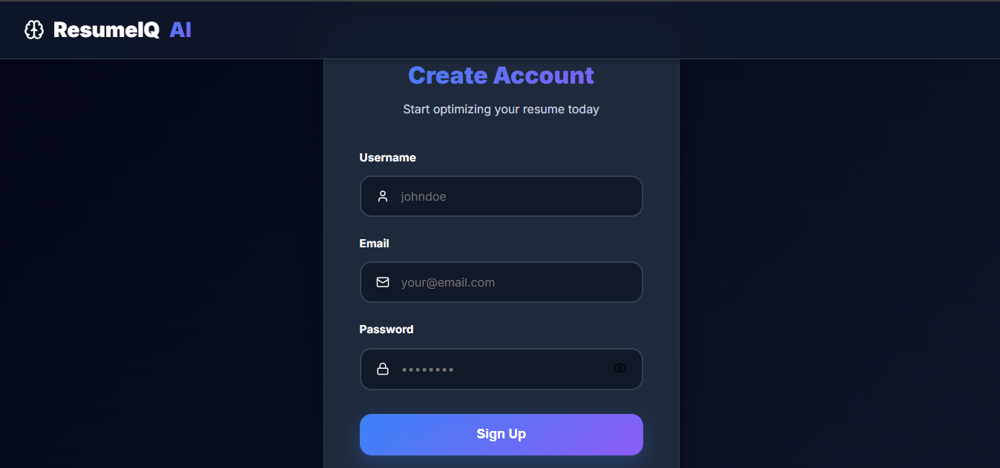
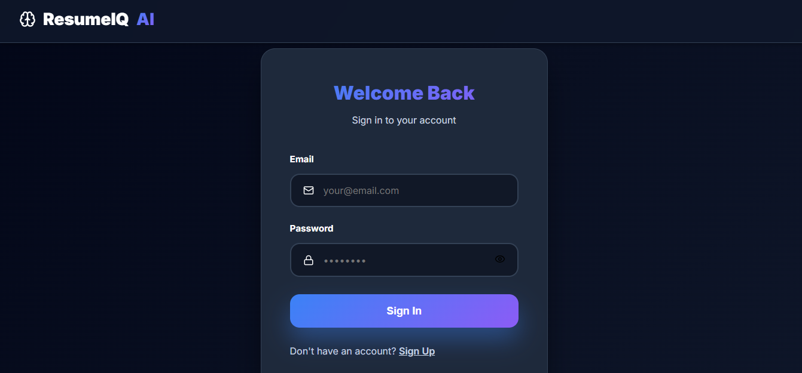

### Dashboard
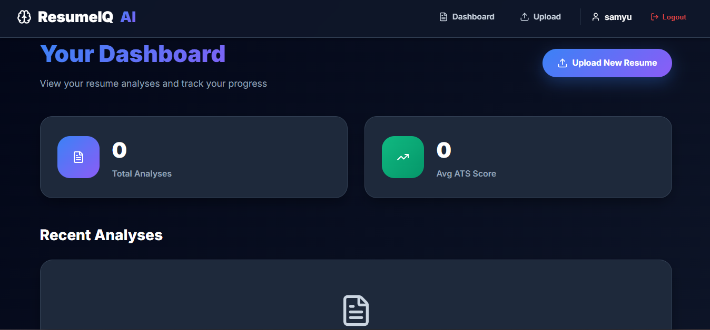

### Upload & Job Description
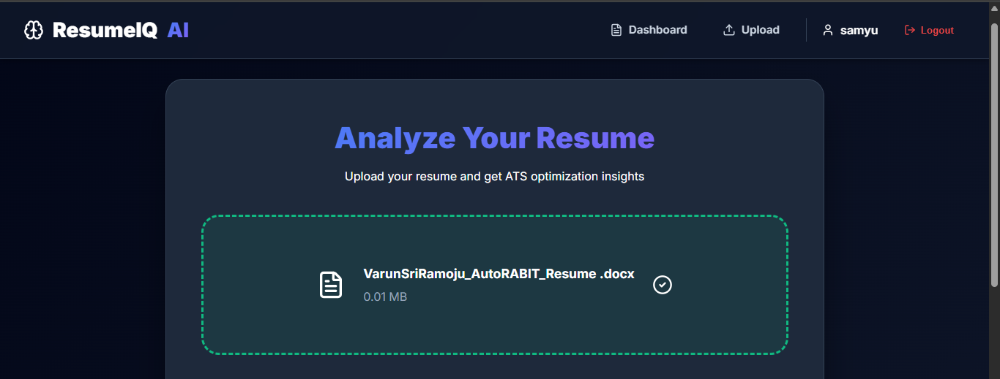
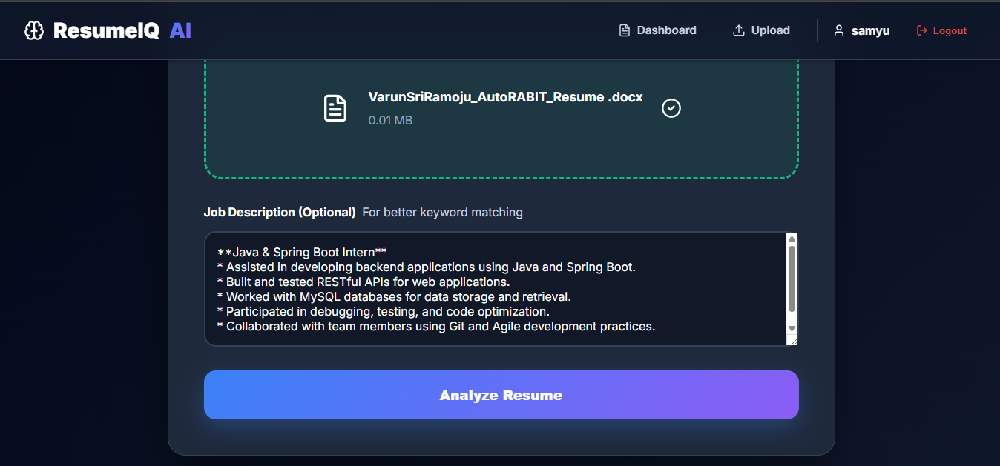

### Analysis
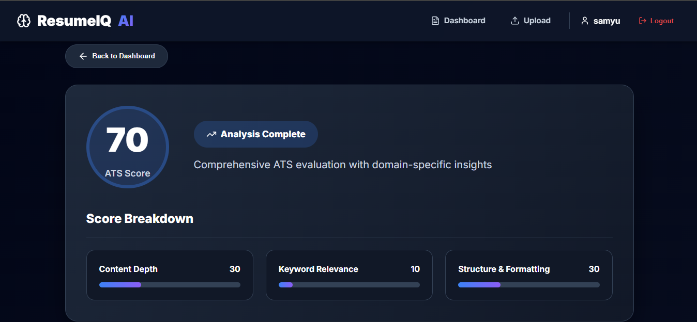
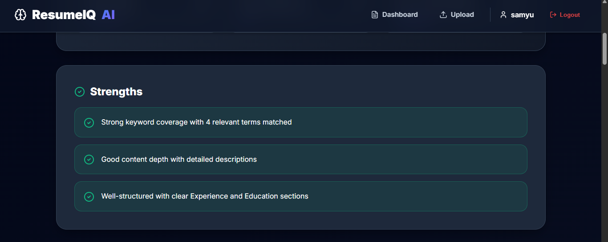
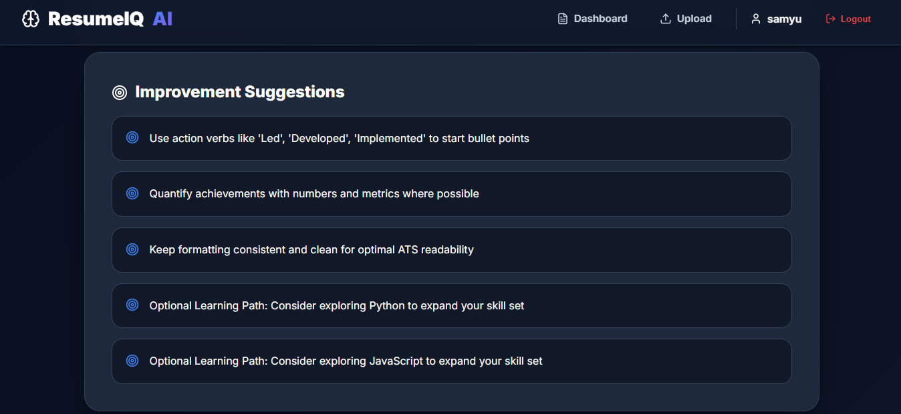
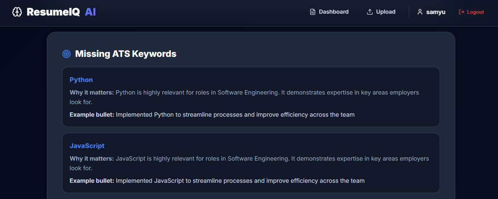
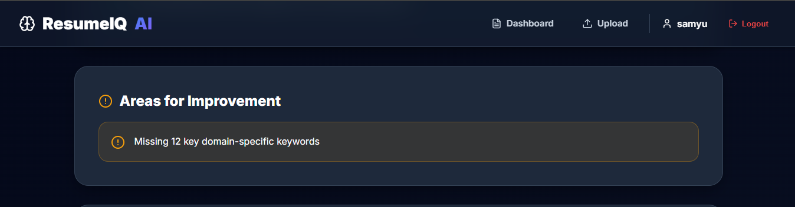
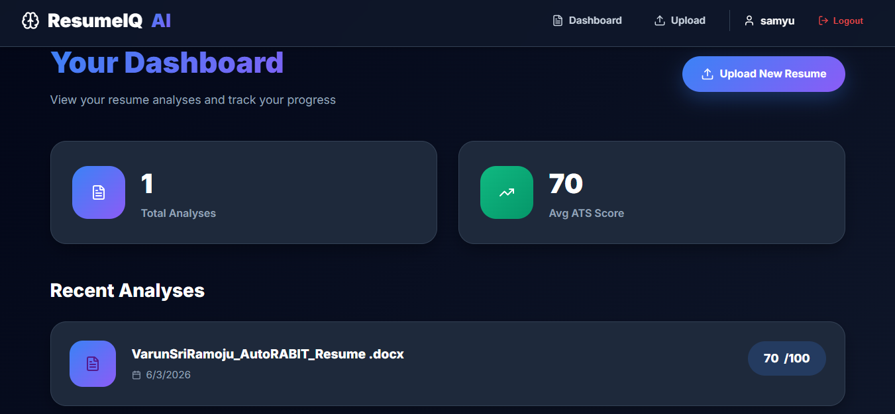

### Download
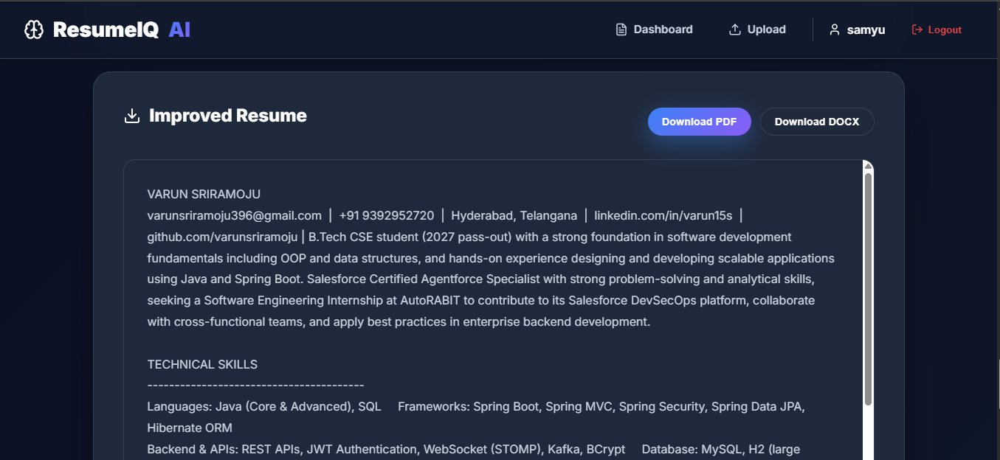

---

## 💬 Contributing

Contributions, issues, and feature requests are welcome!

1. Fork the project
2. Create your feature branch (`git checkout -b feature/AmazingFeature`)
3. Commit your changes (`git commit -m 'Add some AmazingFeature'`)
4. Push to the branch (`git push origin feature/AmazingFeature`)
5. Open a Pull Request

---

## 📝 License

This project is open source and available for personal, educational, and professional use.

---

<div align="center">
  Made with ❤️ using React & Django · Created by <b>Mohammed Razin CR</b>
</div>
